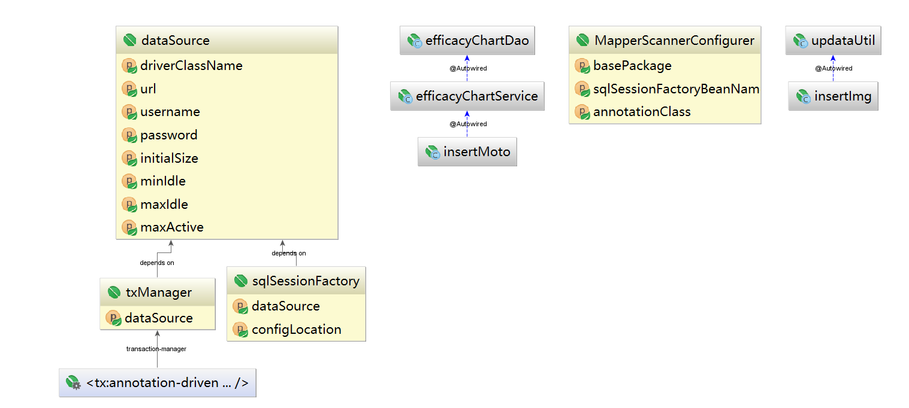
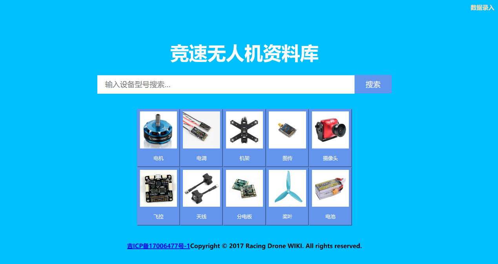
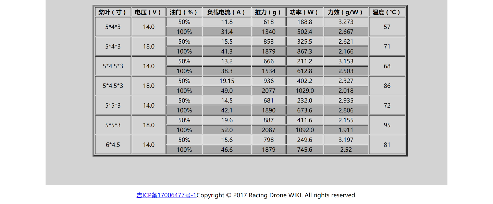

**摘 要**

竞速用无人机 (Racing
Drone)，我们一般称之为穿越机。它与我们日常见到的航拍机完全不同：航拍机是为了拍摄，所以它追求的是稳定、安全和拍摄能力;但是穿越机追求的只有速度、反应和灵活。
为了在赛道上成为最快的无人机，穿越机一般是 DIY
的天下。与组装电脑相类似，组装一台竞速无人机也要去逐一挑选配件，这其中会接触到很多专业的设备性能参数。这些参数并不是每个玩家都可以理解的，而且各个厂家由于没有统一的规范所以使用的参数在单位等方面都有较大的出入，很不便于新手及没有相关专业知识的玩家上手。

竞速无人机在线资料库就在这种背景下应运而生。本程序旨在为广大竞速无人机爱好者提供专业，统一规范，精准的竞速无人机相关产品的参数，性能分析，使用手册等信息，并提供在线虚拟装机功能以及玩家评论等附加功能。本程序为传统BS应用程序，并针对手机和电脑访问做了相应优化，使其在手机和电脑上拥有相同的用户体验。程序使用灵活，可按照电机，电子调速器，飞行控制器等多种分类进行分类浏览，也可对数据库进行模糊查找。本程序使用了java
web的技术体系，经过测试和实际使用，各项指标均达到设计目标。

本文针对无人机玩家的需求，具体阐述了竞速无人机在线资料库的设计、实现、部署及测试。目前本程序以通过阿里云平台上线[www.racingdronewiki.com](http://www.racingdronewiki.com) 并初步开始服务。

1绪论

1.1课题背景
-----------

随着无人机的发展，无人机领域已经得到了飞速的发展，穿越机就算是无人机家族中一特个立独行的款式，有些会玩的玩家通常都会自己买配件进行组装，(就像当年的四驱车一样)，他们会自己组建战队，拍摄自己的飞行视频，追逐各种竞速比赛，其中在
各种穿越机比赛获得冠军就成为了国内众多玩家的追求。

2017竞速无人机（穿越机）走进奥林匹克赛场自去年以来，无人机驾驶竞赛人气飙升，在迪拜举办的奖金100万美元的世界无人机大奖赛是迄今为止最令人瞩目的大赛之一。

迪拜的世界无人机竞速赛才刚刚落下帷幕，近日又有外媒报道称，阿联酋赛事举办方高层还宣布将在2017年12月召开世界未来体育竞赛（World
Future Sports
Games），比赛为期三天，将每隔两年举办一次。比赛的项目包括：竞速无人机穿越飞行、器人游泳、跑步、摔跤赛事等，可以说是机器人界的奥林匹克运动会。

1.2相关研究
-----------

互联网技术的飞速发展带动了竞速无人机的高速发展，如今的竞速无人机并不像它的前辈航模一样主要依靠言传身教等线下交流方式。竞速无人机所使用的大量技术都是由一些开源机构、开源社区来进行维护的，且国内目前已出现了一些氛围好、人员专业的论坛和社区。下面来介绍一些其中的佼佼者。

### 1.2.1 BetaFlight

BetaFlight是用于多旋翼飞行器和固定翼飞行器的飞行控制器软件（固件）。

Betaflight具有以下功能：

-   多色RGB LED条支持（每个LED可以是不同颜色使用可变长度WS2811 RGB条 -
    用于方位指示，低电量警告，飞行模式状态，初始化，故障排除等）

-   DShot（150,300,600和1200），Multishot和Oneshot（125和42）电机协议支持

-   Blackbox飞行记录仪记录（到板载闪存或外部microSD卡）

-   支持使用STM32 F7，F4，F3和F1处理器的飞行控制器

-   PWM，PPM和串行（SBus，SumH，SumD，Spektrum
    1024/2048，XBus等）具有故障安全检测的RX连接

-   多个遥测协议（CSRF，FrSky，HoTT smart-port，MSP等）

-   RSSI通过ADC - 使用ADC读取PWM RSSI信号，使用FrSky
    D4R-II，X8R，X4R-SB和XSR进行测试

-   OSD支持和配置，无需第三方OSD软件/固件/通讯设备

-   OLED显示器 - 显示信息：电池电压/电流/
    mAh，配置文件，速率配置文件，模式，版本，传感器等

-   飞行中手动PID调节和速率调整

-   价格简介和飞行中的选择

-   串行接收，遥测，ESC遥测，MSP，GPS，OSD，声纳等可配置的串行端口 -
    使用大多数设备在任何端口，软件上运行

-   VTX支持Unify Pro和IRC Tramp

-   和更多，更多。

### 1.2.2模友之吧

模友之吧 http://www.moz8.com 于2013年创建的公益性学习网站！建站初衷是为国内航模无人机及其他类模型爱好者创造一个更具团结、互助、开源、创新品质的精神园地；论坛成立以来，通过测试、捐助、举办设计比赛等多种形式免费赠送给会员各类航模、无人机配件、耗材、图纸等10000多人次，价值近100万元，为模型界培养了大量的后备力量，论坛积累了大量优秀的学习资料和教程550000多篇，目前共有全国（包括港澳台）会员63000多人，未来两年内预计可以突破100000会员，力争在10年内秉持初衷，成为全球最好的模型爱好者综合性中文交流平台。

2相关技术概况

在介绍竞速无人机在线数据库之前，先对本软件的架构以及技术原理进行简要介绍。

2.1 Java Web
------------

Java
Web，是用Java技术来解决相关web互联网领域的技术总和。web包括：web服务器和web客户端两部分。Java在客户端的应用有java
applet，不过使用得很少，Java在服务器端的应用非常的丰富，比如Servlet，JSP和第三方框架等等。Java技术对Web领域的发展注入了强大的动力。

### 2.1.1 Java语言

Java是一门面向对象编程语言，不仅吸收了C++语言的各种优点，还摒弃了C++里难以理解的多继承、指针等概念，因此Java语言具有功能强大和简单易用两个特征。Java语言作为静态面向对象编程语言的代表，极好地实现了面向对象理论，允许程序员以优雅的思维方式进行复杂的编程。

Java具有简单性、面向对象、分布式、健壮性、安全性、平台独立与可移植性、多线程、动态性等特点。Java可以编写桌面应用程序、Web应用程序、分布式系统和嵌入式系统应用程序等。

### 2.1.2 Spring

Spring是一个开放源代码的设计层面框架，他解决的是业务逻辑层和其他各层的松耦合问题，因此它将面向接口的编程思想贯穿整个系统应用。Spring是于2003
年兴起的一个轻量级的Java 开发框架，由Rod
Johnson创建。简单来说，Spring是一个分层的Java SE/EE
full-stack(一站式) 轻量级开源框架。

### 2.1.3 Spring MVC

通过策略接口，Spring 框架是高度可配置的，而且包含多种视图技术，例如 Java Server
Pages（JSP）技术、Velocity、Tiles、iText和POI。Spring MVC
框架并不知道使用的视图，所以不会强迫开发者只使用 JSP 技术。Spring MVC
分离了控制器、模型对象、过滤器以及处理程序对象的角色，这种分离让它们更容易进行定制。

### 2.1.4 Servlet

Servlet（Server Applet）是Java
Servlet的简称，称为小服务程序或服务连接器，用Java编写的服务器端程序，主要功能在于交互式地浏览和修改数据，生成动态Web内容。

Servlet运行于支持Java的应用服务器中。从原理上讲，Servlet可以响应任何类型的请求，但绝大多数情况下Servlet只用来扩展基于HTTP协议的Web服务器。

最早支持Servlet标准的是JavaSoft的Java Web
Server，此后，一些其它的基于Java的Web服务器开始支持标准的Servlet。

### 2.1.5 Jsp脚本语言

JSP全名为Java Server
Pages，中文名叫java服务器页面，其根本是一个简化的Servlet设计，它是由Sun
Microsystems公司倡导、许多公司参与一起建立的一种动态网页技术标准。JSP技术有点类似ASP技术，它是在传统的网页HTML（标准通用标记语言的子集）文件(\*.htm,\*.html)中插入Java程序段(Scriptlet)和JSP标记(tag)，从而形成JSP文件，后缀名为(\*.jsp)。
用JSP开发的Web应用是跨平台的，既能在Linux下运行，也能在其他操作系统上运行。

它实现了Html语法中的java扩展（以 \<%,
%\>形式）。JSP与Servlet一样，是在服务器端执行的。通常返回给客户端的就是一个HTML文本，因此客户端只要有浏览器就能浏览。

JSP技术使用Java编程语言编写类XML的tags和scriptlets，来封装产生动态网页的处理逻辑。网页还能通过tags和scriptlets访问存在于服务端的资源的应用逻辑。JSP将网页逻辑与网页设计的显示分离，支持可重用的基于组件的设计，使基于Web的应用程序的开发变得迅速和容易。
JSP(JavaServer
Pages)是一种动态页面技术，它的主要目的是将表示逻辑从Servlet中分离出来。

Java Servlet是JSP的技术基础，而且大型的Web应用程序的开发需要Java
Servlet和JSP配合才能完成。JSP具备了Java技术的简单易用，完全的面向对象，具有平台无关性且安全可靠，主要面向因特网的所有特点。

2.2 Tomcat 服务器
-----------------

Tomcat是Apache 软件基金会（Apache Software Foundation）的Jakarta
项目中的一个核心项目，由Apache、Sun
和其他一些公司及个人共同开发而成。由于有了Sun 的参与和支持，最新的Servlet 和JSP
规范总是能在Tomcat 中得到体现，Tomcat 5支持最新的Servlet 2.4 和JSP 2.0
规范。因为Tomcat 技术先进、性能稳定，而且免费，因而深受Java
爱好者的喜爱并得到了部分软件开发商的认可，成为目前比较流行的Web 应用服务器。

Tomcat 服务器是一个免费的开放源代码的Web
应用服务器，属于轻量级应用服务器，在中小型系统和并发访问用户不是很多的场合下被普遍使用，是开发和调试JSP
程序的首选。对于一个初学者来说，可以这样认为，当在一台机器上配置好Apache
服务器，可利用它响应HTML（标准通用标记语言下的一个应用）页面的访问请求。实际上Tomcat是Apache
服务器的扩展，但运行时它是独立运行的，所以当你运行tomcat
时，它实际上作为一个与Apache 独立的进程单独运行的。

诀窍是，当配置正确时，Apache 为HTML页面服务，而Tomcat 实际上运行JSP
页面和Servlet。另外，Tomcat和IIS等Web服务器一样，具有处理HTML页面的功能，另外它还是一个Servlet和JSP容器，独立的Servlet容器是Tomcat的默认模式。不过，Tomcat处理静态HTML的能力不如Apache服务器。目前Tomcat最新版本为9.0。

2.3 MVC Model 2 模式
--------------------

Web
向软件开发人员提出了一些特有的挑战，最明显的就是客户机和服务器的无状态连接。这种无状态行为使得模型很难将更改通知视图。在
Web 上，为了发现对应用程序状态的修改，浏览器必须重新查询服务器。

View接受用户输入,并传递到Controller.

Controller统一进行处理命令,交由Model处理具体的业务.

经过处理Model更新后,Controller会选一个View并把Model内容传递(request,session)给它(forward).然后View进行显示.

这种模式相对MVC优势很明显，首先Model和View无需继承甚么东西，其次Model和View无需了解对方的存在，只需准备相应的接口而已；缺点是Controller层变得相对复杂了。

2.4 数据持久化
--------------

### 2.4.1 Mysql 数据库

MySQL是一个关系型数据库管理系统，由瑞典MySQL AB 公司开发，目前属于 Oracle
旗下产品。MySQL 是最流行的关系型数据库管理系统之一，在 WEB
应用方面，MySQL是最好的 RDBMS (Relational Database Management
System，关系数据库管理系统) 应用软件。

MySQL是一种关系数据库管理系统，关系数据库将数据保存在不同的表中，而不是将所有数据放在一个大仓库内，这样就增加了速度并提高了灵活性。

MySQL所使用的 SQL 语言是用于访问数据库的最常用标准化语言。MySQL
软件采用了双授权政策，分为社区版和商业版，由于其体积小、速度快、总体拥有成本低，尤其是开放源码这一特点，一般中小型网站的开发都选择
MySQL 作为网站数据库。

由于其社区版的性能卓越，搭配 PHP 和 Apache 可组成良好的开发环境。

### 2.4.2 Mybatis

MyBatis 是一款优秀的持久层框架，它支持定制化 SQL、存储过程以及高级映射。MyBatis
避免了几乎所有的 JDBC 代码和手动设置参数以及获取结果集。MyBatis 可以使用简单的
XML 或注解来配置和映射原生信息，将接口和 Java 的 POJOs(Plain Old Java
Objects,普通的 Java对象)映射成数据库中的记录。

MyBatis是支持普通 SQL查询，存储过程和高级映射的优秀持久层框架。MyBatis
消除了几乎所有的JDBC代码和参数的手工设置以及结果集的检索。MyBatis 使用简单的
XML或注解用于配置和原始映射，将接口和 Java 的POJOs（Plain Ordinary Java
Objects，普通的 Java对象）映射成数据库中的记录。

每个MyBatis应用程序主要都是使用SqlSessionFactory实例的，一个SqlSessionFactory实例可以通过SqlSessionFactoryBuilder获得。SqlSessionFactoryBuilder可以从一个xml配置文件或者一个预定义的配置类的实例获得。

用xml文件构建SqlSessionFactory实例是非常简单的事情。推荐在这个配置中使用类路径资源（classpath
resource)，但你可以使用任何Reader实例，包括用文件路径或 file:// 开头的url创建的实例。MyBatis有一个实用类----Resources，它有很多方法，可以方便地从类路径及其它位置加载资源。

2.5 Web前端技术
---------------

### 2.5.1 HTML超文本标记语言

超级文本标记语言是标准通用标记语言下的一个应用，也是一种规范，一种标准，它通过标记符号来标记要显示的网页中的各个部分。网页文件本身是一种文本文件，通过在文本文件中添加标记符，可以告诉浏览器如何显示其中的内容（如：文字如何处理，画面如何安排，图片如何显示等）。浏览器按顺序阅读网页文件，然后根据标记符解释和显示其标记的内容，对书写出错的标记将不指出其错误，且不停止其解释执行过程，编制者只能通过显示效果来分析出错原因和出错部位。但需要注意的是，对于不同的浏览器，对同一标记符可能会有不完全相同的解释，因而可能会有不同的显示效果。

### 2.5.2 CSS层叠样式层

层叠样式表(英文全称：Cascading Style
Sheets)是一种用来表现HTML（标准通用标记语言的一个应用）或XML（标准通用标记语言的一个子集）等文件样式的计算机语言。CSS不仅可以静态地修饰网页，还可以配合各种脚本语言动态地对网页各元素进行格式化。

CSS
能够对网页中元素位置的排版进行像素级精确控制，支持几乎所有的字体字号样式，拥有对网页对象和模型样式编辑的能力。

### 2.5.2 JavaScript 脚本语言

JavaScript是一种属于网络的脚本语言,已经被广泛用于Web应用开发,常用来为网页添加各式各样的动态功能,为用户提供更流畅美观的浏览效果。通常JavaScript脚本是通过嵌入在HTML中来实现自身的功能的。是一种解释性脚本语言（代码不进行预编译）。主要用来向HTML（标准通用标记语言下的一个应用）页面添加交互行为。可以直接嵌入HTML页面，但写成单独的js文件有利于结构和行为的分离。跨平台特性，在绝大多数浏览器的支持下，可以在多种平台下运行（如Windows、Linux、Mac、Android、iOS等）。

Javascript脚本语言同其他语言一样，有它自身的基本数据类型，表达式和算术运算符及程序的基本程序框架。Javascript提供了四种基本的数据类型和两种特殊数据类型用来处理数据和文字。而变量提供存放信息的地方，表达式则可以完成较复杂的信息处理。

2.6 运行平台
------------

### 2.6.1 Centos Linux 服务器

CentOS 是一个基于Red Hat Linux
提供的可自由使用源代码的企业级Linux发行版本。每个版本的
CentOS都会获得十年的支持（通过安全更新方式）。新版本的 CentOS
大约每两年发行一次，而每个版本的 CentOS
会定期（大概每六个月）更新一次，以便支持新的硬件。这样，建立一个安全、低维护、稳定、高预测性、高重复性的
Linux 环境。[1] CentOS是Community Enterprise Operating System的缩写。

CentOS 是RHEL（Red Hat Enterprise
Linux）源代码再编译的产物，而且在RHEL的基础上修正了不少已知的 Bug ，相对于其他
Linux 发行版，其稳定性值得信赖。

### 2.6.2 阿里云平台

阿里云创立于2009年，是全球领先的云计算及人工智能科技公司，致力于以在线公共服务的方式，提供安全、可靠的计算和数据处理能力，让计算和人工智能成为普惠科技。

阿里云服务着制造、金融、政务、交通、医疗、电信、能源等众多领域的领军企业，包括中国联通、12306、中石化、中石油、飞利浦、华大基因等大型企业客户，以及微博、知乎、锤子科技等明星互联网公司。在天猫双11全球狂欢节、12306春运购票等极富挑战的应用场景中，阿里云保持着良好的运行纪录。

阿里云在全球各地部署高效节能的绿色数据中心，利用清洁计算为万物互联的新世界提供源源不断的能源动力，目前开服的区域包括中国（华北、华东、华南、香港）、新加坡、美国（美东、美西）、欧洲、中东、澳大利亚、日本。

3 系统需求分析与设计

3.1需求分析与框架设计
---------------------

### 3.1.1总体需求分析

基于java web
及相关技术构建BS应用程序。实现在线搜索查询竞速无人机相关产品信息，在线虚拟组装并计算理论最大推力，理论飞机自重，并根据用户选择的无人机配件给出合理化建议。

开放数据库的数据维护及新产品信息录入开放接口，使用户参与到数据库建设中，促进形成完善的信息录入体系。用户可通过网站中的信息录入页面进行信息录入，在信息经过审核后会加入到数据库中供其他玩家使用。

### 3.1.2用户需求分析

对于无人机玩家用户系统用例图如图所示

### 在线数据查询

数据查询主要分为两种查询方式，模糊查询，即用户输入自己要查询的设备型号或设备制造商等信息进行模糊查找；以及分类查找主要包括电机、电子调速器、飞行控制器、图像传输模块、摄像头、分电板、无人机机架、电池、螺旋桨，天线等分类。玩家可利用数据库进行设备性能比较。

### 在线虚拟组装

本程序提供一个可以在线虚拟组装竞速无人机的工具，玩家可以在数据库中检索自己需要的设备并利用虚拟装机工具进行虚拟装机。本工具可帮助玩家进行设备选择，主动帮助玩家避免设备之间的不适配，以及由搭配不均衡导致的某个模块的性能过剩，同时可主动帮助玩家进行用电分析并优化供电方案。

在进行虚拟组装后本程序还可以跟所选设备的参数计算出飞机的重量，最大推力，推重比，并对玩家虚拟组装的无人机给与合理化建议。根据此功能玩家可以在进行飞机组装前了解飞机的整体性能，并最大限度地优化自己的飞机。

### 数据录入

秉承着无人机开源互助的大环境同时也为了保证数据库数据的专业、精准以及更新的及时，我们设计了开放式的数据维护平台，对玩家开放数据库的数据录入接口和数据修改接口，只要玩家按照我们提供的数据格式和单位提供正确的数据在经过审核无误后都将被程序采用。

3.2 竞速无人机在线资料库数据库设计 
-----------------------------------

根据需求分析以及个模块的功能对数据库进行详细，设计数据库设计图如下。

Antenna（天线）表字段说明

| **限定符和类型** | **字段**                  |
|------------------|---------------------------|
| float            | **axialRatic** 轴比       |
| Char             | **connectors** 天线插头   |
| Char             | **frequency** 天线频率    |
| float            | **gain** 增益             |
| float            | **length** 长度           |
| Char             | **polarization** 极化方式 |

Battery（电池）表字段说明

| **限定符和类型** | **字段**                                    |
|------------------|---------------------------------------------|
| int              | **capacity** 容量                           |
| Char             | **connector** 插头类型                      |
| int              | **dischargeRate** 放电倍率                  |
| int              | **instantaneousDischargeRate** 瞬时放电倍率 |
| float            | **length** 长度                             |
| int              | **maxChargingRate** 最大充电倍率            |
| float            | **maximumChargeCurrent** 最大充电电流       |
| float            | **recommendedChargingCurrent** 推荐充电电流 |
| float            | **thickness** 厚度                          |
| float            | **voltage** 电压                            |
| float            | **width** 宽度                              |
| int              | **wireLength** 电源线长度                   |
| int              | **wireNumber** 电源线号                     |

Cam（摄像头）表字段说明

| **限定符和类型** | **字段**                                |
|------------------|-----------------------------------------|
| boolean          | **autoGainControl** 自动增益            |
| boolean          | **backLightCompensation** 背光补偿      |
| Char             | **dayNight** 日夜切换                   |
| Char             | **dnr** 数字降噪                        |
| Char             | **electronicShutterSpeed** 电子快门速度 |
| private int      | **horizontalResolustion** 水平分辨率    |
| Char             | **housingMasterial** 外壳材料           |
| Char             | **imageSensor** 图像传感器              |
| Char             | **inputVoltages** 输入电压              |
| boolean          | **integratedMic** 集成MIC               |
| boolean          | **integratedOsd** 结成OSD               |
| float            | **length** 长度                         |
| int              | **lensFov** 镜头视场                    |
| Char             | **minIllumination** 最低照度            |
| Char             | **signalSystem** 信号制式               |
| Char             | **snRatio** 信噪比                      |
| float            | **thickness** 厚度                      |
| boolean          | **useAlone** 是否可单独使用             |
| Char             | **wdr** 宽动态                          |
| float            | **width** 宽度                          |

EfficacyChart（力效表）表字段信息

| **限定符和类型** | **字段**                        | **说明**  |
|------------------|---------------------------------|-----------|
| float            | **fullEfficlency** 满油门效率   |           |
| float            | **fullLoadCurrency** 满油门电流 |           |
| float            | **fullPower** 满油门功率        |           |
| int              | **fullPull** 满油门推力         |           |
| float            | **halfEfficlency** 半油门效率   |           |
| float            | **halfLoadCurrency** 半油门电流 |           |
| float            | **halfPower** 半油门功率        |           |
| int              | **halfPull** 半油门推力         |           |
| int              | **id** 力效表ID                 | 主键 自增 |
| Char             | **motoModel** 电机型号          |           |
| Char             | **prop** 使用螺旋桨             |           |
| int              | **temperature** 温度            |           |
| float            | **voltages** 电压               |           |

ElectroSpeedRegulator（电子调速器）表字段信息

| **限定符和类型** | **字段和说明**                        |
|------------------|---------------------------------------|
| Char             | **controlChip** 主控制芯片            |
| boolean          | **dshot** dshot输入模式               |
| Char             | **firmware** 固件                     |
| boolean          | **fourInone** 四合一                  |
| int              | **instantaneousCurrent** 瞬时工作电流 |
| float            | **length** 长度                       |
| boolean          | **mutishot** mutishot输入模式         |
| Char             | **noOfCells** 支持锂电池电芯片数      |
| boolean          | **oneshot125** oneshot125输入模式     |
| boolean          | **oneshot42** oneshot42输入模式       |
| int              | **persistentCurrent** 持续工作电流    |
| boolean          | **pwmMode** PWM输入模式               |
| float            | **thickness** 厚度                    |
| boolean          | **useAlone** 可单独使用               |
| float            | **width** 宽度                        |

FlightControl（飞控）表字段说明

| **限定符和类型**                                                                                                        | **字段和说明**                        |
|-------------------------------------------------------------------------------------------------------------------------|---------------------------------------|
| boolean                                                                                                                 | **bootButton** BOOT按键               |
| boolean                                                                                                                 | **buzzer** 内置蜂鸣器                 |
| [ElectroSpeedRegulator](file:///H:\project\RacingDroneWIKI\JavaDoc\com\RacingDroneWIKI\pojo\ElectroSpeedRegulator.html) | **esc** 内置电子调速器00              |
| [ImageTransmission](file:///H:\project\RacingDroneWIKI\JavaDoc\com\RacingDroneWIKI\pojo\ImageTransmission.html)         | **imageTransmission** 内置图传        |
| float                                                                                                                   | **length** 长度                       |
| int                                                                                                                     | **maxGyroUpdata** 最大陀螺仪刷新率    |
| int                                                                                                                     | **maxPidLoopFrequancy** 最大PID刷新率 |
| Char                                                                                                                    | **mcu** mcu                           |
| float                                                                                                                   | **mountingHoleSpacing** 安装孔距      |
| Char                                                                                                                    | **mpu** mpu                           |
| boolean                                                                                                                 | **osd** 内置OSD                       |
| Char                                                                                                                    | **pinDefintionDiagram** 阵脚定义图    |
| Char                                                                                                                    | **powerHub** 内置分电板               |
| boolean                                                                                                                 | **sdcard** SD卡支持                   |
| float                                                                                                                   | **thickness** 厚度                    |
| float                                                                                                                   | **width** 宽度                        |

Frame（机架）表字段信息

| **限定符和类型**                                                                              | **字段和说明**                         |
|-----------------------------------------------------------------------------------------------|----------------------------------------|
| float                                                                                         | **armThickness** 机臂厚度              |
| float                                                                                         | **bottomThickness** 下板厚度           |
| Char                                                                                          | **camraAdjustingAngle** 摄像头可调角度 |
| float                                                                                         | **fcMountingHoleSpacing** 飞控安装孔距 |
| boolean                                                                                       | **integratedLed** 内置LED              |
| [PowerHub](file:///H:\project\RacingDroneWIKI\JavaDoc\com\RacingDroneWIKI\pojo\PowerHub.html) | **integratedPh** 内置分电板            |
| Char                                                                                          | **material** 主要材料                  |
| int                                                                                           | **maximumSupportProp** 最大可用螺旋桨  |
| float                                                                                         | **roofThickness** 顶板厚度             |
| int                                                                                           | **wheekBase** 轴距                     |

ImageTransmission（图传）表字段信息

| **限定符和类型** | **字段和说明**                       |
|------------------|--------------------------------------|
| Char             | **antennaConnectors** 天线接头       |
| Char             | **audioCarrierFrequency** 音频带宽   |
| Char             | **audioInputImpedance** 音频输入阻抗 |
| Char             | **audioInputLevel** 音频输入水平     |
| boolean          | **audioSupport** 音频支持            |
| Char             | **cam** 内置摄像头                   |
| int              | **frequencyQuantity** 频道数         |
| Char             | **frequencyTable** 频率表            |
| Char             | **inputVoltage** 输入电压            |
| boolean          | **integratedMic** 内置收音器         |
| float            | **length** 长度                      |
| Char             | **outputPower** 输出功率             |
| Char             | **outputVoltage** 输出电压           |
| Char             | **pinDefinitionDiagram** 引脚定义图  |
| boolean          | **powerAdjustable** 功率可调         |
| boolean          | **sbus** SBUS支持                    |
| float            | **thickness** 厚度                   |
| boolean          | **useAlone** 可单独使用              |
| Char             | **videoBandWidth** 视频带宽          |
| Char             | **videoInputLevel** 视频输入电平     |
| float            | **width** 宽度                       |

Moto（电机）表字段信息

| **限定符和类型** | **字段和说明**               |
|------------------|------------------------------|
| float            | **diameter** 直径            |
| Char             | **efficacyChart** 力效表     |
| float            | **idleCurrent** 空载电流     |
| int              | **internalReslstance** 内阻  |
| int              | **kv** KV值                  |
| float            | **length** 长度              |
| int              | **maxThrust** 最大推力       |
| Char             | **noOfCells** 支持锂电池节数 |
| Char             | **propeller** 支持螺旋桨     |
| float            | **shaftDiameter** 轴径       |
| float            | **statorDiameter** 定子直径  |
| float            | **statorLength** 定子长度    |

PowerHub（分电板）表字段说明

| **限定符和类型** | **字段和说明**                      |
|------------------|-------------------------------------|
| boolean          | **bec12v** 12V供电                  |
| boolean          | **bec5v** 5V供电                    |
| boolean          | **bec9v** 9V供电                    |
| float            | **length** 长度                     |
| int              | **maxCurrent** 最大电流             |
| float            | **mountingHoleSpacing** 安装孔间距  |
| Char             | **pinDefinitionDiagram** 引脚定义图 |
| float            | **thickness** 厚度                  |
| boolean          | **useAlone** 可单独使用             |
| float            | **width** 宽度                      |

Prop（桨叶）表字段说明

| **限定符和类型** | **字段和说明**                   |
|------------------|----------------------------------|
| int              | **bladeNumber** 叶片数           |
| Char             | **material** 材料                |
| float            | **mountingHoleSpacing** 安装孔距 |
| Char             | **size** 尺寸                    |

3.3 框架设计与实现’
-------------------

本项目使用SSM（Spring+SpringMVC+MyBatis）框架实现。其中spring是一个轻量级的控制反转（IoC）和面向切面（AOP）的容器框架。SpringMVC分离了控制器、模型对象、分派器以及处理程序对象的角色，这种分离让它们更容易进行定制。MyBatis是一个支持普通SQL查询，存储过程和高级映射的优秀持久层框架。

### Spring SpringMVC Mybatis整合结构

### Bean配置及引用关系

3.4界面设计
-----------

### 主界面

### 列表展示界面

### 详细信息界面

### 数据录入选择界面

### 数据录入界面

### 虚拟装机以及装机提示信息界面

4 **系统功能**实现与测试

本系统整体上使用Spring+Spring
MVC+Mybatis框架（如下图所示），数据库采用mysql数据库，tomcat作为服务器容器，ContenOS作为服务器系统。

接下来对几个核心模块包括数据展示，数据录入模块，虚拟组装模块的实现过程进行阐述，最后对系统部署以及测试进行测试。

4.1数据展示模块
---------------

数据展示模块是竞速无人机在线资料库所有功能的基础，分为分类显示以及搜索展示。

### 4.1.1分类展示

用户可通过主页面搜索框下的导航栏和所有页面的顶部导航栏（如图所示）进行分类数据展示

每一个分类都有一个固定的URL作为请求入口例如电机“/moto_1”，使用了RESTful的URL设计风格。URL中“moto”指分类请求中的电机分类，“_1”指电机分类的第一个页。

利用Spring
MVC的DispatcherServlet对请求进行分发并交由Control进行处理，在分类数据展示模块中响应分类数据请求的是SearchAll类，其中为每种分类定义了处理响应方法，每种分类处理步骤基本相同一下以飞控分类进行介绍。

以下是SearchAll类中对飞控分类进行相应的代码

*/\*\**  
*\* 响应获取并展示飞控列表的请求*  
*\* Flight control list string.*  
*\**  
*\* \@param model the SpringMVC model*  
*\* \@param page the page 当前页号*  
*\* \@return the URI string*  
*\*/*  
\@RequestMapping(value = **"/flightControl_{page}"**)  
**public** String flightControlList(Model model, \@PathVariable(value =
**"page"**) **int** page,HttpServletRequest request) {  
request.getSession().invalidate();  
List\<FlightControl\> list = **flightControlService**.findAll();  
**pages** = list.size() % **PAGENUMBER** != 0 ? list.size() / **PAGENUMBER** + 1
: list.size() / **PAGENUMBER**;  
**first** = (page - 1) \* **PAGENUMBER**;  
**last** = list.size() \> (**first** + **PAGENUMBER**) ? **first** +
**PAGENUMBER** : list.size();  
list = list.subList(**first**, **last**);  
model.addAttribute(**"uri"**, **"/flightControl_"**);  
model.addAttribute(**"pages"**, **pages**);  
model.addAttribute(**"page"**, page);  
model.addAttribute(**"flightControlList"**, list);  
**return "resultSet"**;  
}

使用\@RequestMapping注解将flightControlList方法与用户的飞控类展示请求绑定。利用Spring
MVC的自动映射功能将URL中包含的page页号传递给int
page变量。使用\@autoWrite注解自动注入FlightControlService（飞控数据库Dao层实现），并使用flightControlService的findAll（）方法获取数据库中飞控表的所有信息并将结果存储到list中。利用url地址中给定的页号截取list，并使用Spring
MVC的Model类型包装需要给前台提供的参数，其中“flightControlList”代表传递给前端的飞控结果集合，”uri“是为了使”resultSet.jps”（列表展示页面，稍后会详细介绍）能够同时响应分类展示和搜索展示提供参数，”pages“代表数据库中的飞控信息可以分成几页展示，”page“表示当前所在页号。

### 4.1.2搜索展示

以下是SearchByModel类中搜索展示的核心方法

*/\*\**  
*\* 响应用户搜索请求*  
*\* Search string.*  
*\**  
*\* \@param searchModel the search model 用户搜索的模型ID*  
*\* \@param model the SpringMVC model*  
*\* \@param page the page 当前页号*  
*\* \@return the URI string*  
*\*/*  
\@RequestMapping(value = **"/search_{page}"**)  
**public** String search(\@RequestParam(**"searchModel"**) String searchModel,  
Model model, \@PathVariable(value = **"page"**) **int** page, HttpServletRequest
request) {  
request.getSession().invalidate();  
List\<Moto\> motoList = **new** LinkedList\<\>();  
List\<ElectroSpeedRegulator\> electroSpeedRegulatorList = **new**
LinkedList\<\>();  
List\<Frame\> frameList = **new** LinkedList\<\>();  
List\<ImageTransmission\> imageTransmissionList = **new** LinkedList\<\>();  
List\<Cam\> camList = **new** LinkedList\<\>();  
List\<FlightControl\> flightControlList = **new** LinkedList\<\>();  
List\<Antenna\> antennaList = **new** LinkedList\<\>();  
List\<PowerHub\> powerHubList = **new** LinkedList\<\>();  
List\<Prop\> propList = **new** LinkedList\<\>();  
List\<Battery\> batteryList = **new** LinkedList\<\>();  
**int** pages=0;  
**int** first;  
**int** last;  
**int** size;  
**if** (!searchModel.equals(**""**)) {  
**search**.searchModel(searchModel, motoList, electroSpeedRegulatorList,
frameList,  
imageTransmissionList, camList, flightControlList, antennaList,  
powerHubList, propList, batteryList);  
size = motoList.size() + electroSpeedRegulatorList.size()  
+ frameList.size() + imageTransmissionList.size() +  
camList.size() + flightControlList.size() + antennaList.size()  
+ powerHubList.size() + propList.size() + batteryList.size();  
  
pages = size % **PAGENUMBER** != 0 ? size / **PAGENUMBER** + 1 : size /
**PAGENUMBER**;  
first = (page - 1) \* **PAGENUMBER**;  
last = size \> (first + **PAGENUMBER**) ? first + **PAGENUMBER** : size;  
List\<Item\> list = **new** LinkedList();  
list.addAll(motoList);  
list.addAll(electroSpeedRegulatorList);  
list.addAll(frameList);  
list.addAll(imageTransmissionList);  
list.addAll(camList);  
list.addAll(flightControlList);  
list.addAll(antennaList);  
list.addAll(powerHubList);  
list.addAll(propList);  
list.addAll(batteryList);  
list = list.subList(first, last);  
motoList.clear();  
electroSpeedRegulatorList.clear();  
frameList.clear();  
imageTransmissionList.clear();  
camList.clear();  
flightControlList.clear();  
antennaList.clear();  
powerHubList.clear();  
propList.clear();  
batteryList.clear();  
Iterator\<Item\> itemIterator = list.iterator();  
**while** (itemIterator.hasNext()) {  
Item item = itemIterator.next();  
**if** (item **instanceof** Moto) {  
motoList.add((Moto) item);  
}  
**if** (item **instanceof** ElectroSpeedRegulatora) {  
electroSpeedRegulatorList.add((ElectroSpeedRegulator) item);  
}  
**if** (item **instanceof** Frame) {  
frameList.add((Frame) item);  
}  
**if** (item **instanceof** ImageTransmission) {  
imageTransmissionList.add((ImageTransmission) item);  
}  
**if** (item **instanceof** Cam) {  
camList.add((Cam) item);  
}  
**if** (item **instanceof** FlightControl) {  
flightControlList.add((FlightControl) item);  
}  
**if** (item **instanceof** Antenna) {  
antennaList.add((Antenna) item);  
}  
**if** (item **instanceof** PowerHub) {  
powerHubList.add((PowerHub) item);  
}  
**if** (item **instanceof** Prop) {  
propList.add((Prop) item);  
}  
**if** (item **instanceof** Battery) {  
batteryList.add((Battery) item);  
}  
}  
}  
  
model.addAttribute(**"uri"**, **"/search_"**);  
model.addAttribute(**"pages"**, pages);  
model.addAttribute(**"page"**, page);  
model.addAttribute(**"searchModel"**, **"?searchModel="** + searchModel);  
model.addAttribute(**"motoList"**, motoList);  
model.addAttribute(**"electroSpeedRegulatorList"**, electroSpeedRegulatorList);  
model.addAttribute(**"frameList"**, frameList);  
model.addAttribute(**"imageTransmissionList"**, imageTransmissionList);  
model.addAttribute(**"camList"**, camList);  
model.addAttribute(**"flightControlList"**, flightControlList);  
model.addAttribute(**"antennaList"**, antennaList);  
model.addAttribute(**"powerHubList"**, powerHubList);  
model.addAttribute(**"propList"**, propList);  
model.addAttribute(**"batteryList"**, batteryList);  
**return "resultSet"**;  
}

使用\@RequestMapping注解将search方法与用户的搜索请求绑定。利用Spring
MVC的自动映射功能将URL中包含的page页号传递给int
page变量，用户的搜索字段”searchModel”传递给String
searchModel。利用Spring的IOC技术自动注入需要用到的所有Service层类包括MotoSevice，FrameService等。初始化所有分类的集合，调用Service层相关服务在数据库对应表中使用用户所给定的搜索字段”searchModel”进行查找，并将结果集赋值给刚刚初始化的各分类集合。由于所有分类皆是抽象类“Item”的子类，所有创建Item类集合并将刚刚获得的分类集合添加到Item集合中，再分页信息”page“对Item集合进行截取。使用instanceof关键字对Item集合中的类型进行判断，将Item集合还原成分类集合并赋值给Spring
MVC提供的Model包装类型提供给前台使用。

### 4.1.3 搜索及分类查询结果展示页面

ResultSet.jsp作为两种查询的结果展示页面来使用，为了能够同时响应两种需求，所有引入了JSTL当中的C：IF功能进行动态设置页面内容，\<C:if
test="\${motoList.size\>0}"\>，这段代码为电机集合的C：IF动态设置语句，如果电机集合的长度大于0，那么就说明后台给前端的电机集合中存入了需要展示数据，如果长度等于0那么则说明后台未给前端提供需要展示的点击集合。其他的分了利用了同样的方法来实现。进行分类展示时后台只会给需要展示的分类集合中存入数据，这样在resulSet.jsp中就只会显示需要展示分类，其他分类不会展示出来。同样对于搜索展示，后台会将搜索得到的各个分类集合分别赋值给前端供前端进行判断显示。由于传给前端是的集合对象所以还使用了JSTL当中的C:
forEach进行集合遍历，\<C:forEach items="\${motoList}"
var="item"\>，此为电机集合的遍历代码，使用item可获取集合中的电机对象并进行信息展示。

下列代码为ResultSet.jsp中分页逻辑的关键代码

\<**section id="pagination"**\>  
\<**a href="\${**uri**}1\${**searchModel**}" class="pageBut"** \>  
\<**p**\>首页\</**p**\>  
\</**a**\>  
\<**C:if test="\${**page\>1**}"**\>  
\<**a href="\${**uri**}\${**page-1**}\${**searchModel**}" class="pageBut"** \>  
\<**p**\>上一页\</**p**\>  
\</**a**\>  
\</**C:if**\>  
\<**C:if test="\${**page\<pages**}"**\>  
\<**a href="\${**uri**}\${**page+1**}\${**searchModel**}" class="pageBut"** \>  
\<**p**\>下一页\</**p**\>  
\</**a**\>  
\</**C:if**\>  
\<**a href="\${**uri**}\${**pages**}\${**searchModel**}" class="pageBut"** \>  
\<**p**\>尾页\</**p**\>  
\</**a**\>  
\<**select name="jumpMenu" id="jumpMenu"**  
**onchange="***jumpMenu*(**'parent'**,**this**,0)**"**\>  
\<**C:forEach varStatus="status" begin="1" end="\${**pages**}" var="num"**\>  
\<**option value="\${**uri**}\${**num**}\${**searchModel**}"**\<**C:if
test="\${**page==num**}"**\>**selected="selected"**\</**C:if**\>\>第**\${**num**}**页\</**option**\>  
\</**C:forEach**\>  
\</**select**\>

\<**script type="text/javascript"**\>  
**function** *jumpMenu*(targ,selObj,restore){  
eval(targ+**".location='"**+selObj.**options**[selObj.**selectedIndex**].value+**"'"**);  
**if** (restore) selObj.**selectedIndex**=0;  
}  
\</**script**\>

其中通过EL表达式获取的“uri“，”pages“，”searchModel“属性等在前面介绍分类查询和搜索查询时已经介绍过了。利用动态拼接的URL地址实现了首页，下一页，上一页和未页四个基本跳转，根据后台传入的pages总页数搭配C:forEach动态设置了一个可提供指定页面跳转的单选框。并使用JavaScript监控该组件的onChange事件实现选定后的页面跳转功能。

4.2数据录入模块
---------------

数据录入模块是给用户提供在线无人机设备信息录入的模块，用户可以通过点击主页面右上角的“数据录入”进入该模块。下面将以数据录入模块中最为复杂的飞控数据信息录入为例对数据录入模块进行向西介绍。

在接收到数据录入请求后后台会将包含飞控所有信息表单的页面返回给用户，用户通过填写飞控的信息实现数据录入。数据可能包含文字信息，数字信息，逻辑信息以及图片等。针对数据录入中可能出现的图片上传等操作，提供了“UpdataUtil“工具类对用户上传的图片进行存储，同时为了避免前台调用是产生乱码，UpdatUtil还会对用户上传的图片名进行UTF-8转码。UpdataUtil主要作为Spring
Service供Spring MVC的Control调用。以下是该类的Java Doc。

com.RacingDroneWIKI.service

### 类 UpdataUtil

-   java.lang.Object

-   com.RacingDroneWIKI.service.UpdataUtil

\@Service

public class **UpdataUtil**

extends java.lang.Object

The type Updata util.图片上传服务模块

**版本:**

>   SSM 3.0

**作者:**

### ChunsiYang

-   *字段概要*

| **字段**                |                                                                                                                                                                         |
|-------------------------|-------------------------------------------------------------------------------------------------------------------------------------------------------------------------|
| **限定符和类型**        | **字段和说明**                                                                                                                                                          |
| static java.lang.String | [FREQUENCYTABLE](http://localhost:63342/RacingDroneWIKI/JavaDoc/com/RacingDroneWIKI/service/UpdataUtil.html#FREQUENCYTABLE) The constant FREQUENCYTABLE.                |
| static java.lang.String | [PINDEFINTIONDIAGRAM](http://localhost:63342/RacingDroneWIKI/JavaDoc/com/RacingDroneWIKI/service/UpdataUtil.html#PINDEFINTIONDIAGRAM) The constant PINDEFINTIONDIAGRAM. |

-   *构造器概要*

| **构造器**                                                                                                               |
|--------------------------------------------------------------------------------------------------------------------------|
| **构造器和说明**                                                                                                         |
| [UpdataUtil](http://localhost:63342/RacingDroneWIKI/JavaDoc/com/RacingDroneWIKI/service/UpdataUtil.html#UpdataUtil--)()  |

-   *方法概要*

| **所有方法**[实例方法](javascript:show(2);)[具体方法](javascript:show(8);) |                                                                                                                                                                                                                                                                                                                                                                                                                                                                                                                             |
|----------------------------------------------------------------------------|-----------------------------------------------------------------------------------------------------------------------------------------------------------------------------------------------------------------------------------------------------------------------------------------------------------------------------------------------------------------------------------------------------------------------------------------------------------------------------------------------------------------------------|
| **限定符和类型**                                                           | **方法和说明**                                                                                                                                                                                                                                                                                                                                                                                                                                                                                                              |
| java.lang.String                                                           | [insertImg](http://localhost:63342/RacingDroneWIKI/JavaDoc/com/RacingDroneWIKI/service/UpdataUtil.html#insertImg-com.RacingDroneWIKI.pojo.Item-javax.servlet.http.HttpServletRequest-org.springframework.web.multipart.MultipartFile-)([Item](http://localhost:63342/RacingDroneWIKI/JavaDoc/com/RacingDroneWIKI/pojo/Item.html) item, javax.servlet.http.HttpServletRequest request, org.springframework.web.multipart.MultipartFile img) Insert img string.                                                               |
| java.util.LinkedList\<java.lang.String\>                                   | [insertImgMutl](http://localhost:63342/RacingDroneWIKI/JavaDoc/com/RacingDroneWIKI/service/UpdataUtil.html#insertImgMutl-com.RacingDroneWIKI.pojo.Item-javax.servlet.http.HttpServletRequest-org.springframework.web.multipart.MultipartFile:A-)([Item](http://localhost:63342/RacingDroneWIKI/JavaDoc/com/RacingDroneWIKI/pojo/Item.html) item, javax.servlet.http.HttpServletRequest request, org.springframework.web.multipart.MultipartFile[] img) Insert img mutl linked list.                                         |
| java.lang.String                                                           | [insertSpecialImg](http://localhost:63342/RacingDroneWIKI/JavaDoc/com/RacingDroneWIKI/service/UpdataUtil.html#insertSpecialImg-com.RacingDroneWIKI.pojo.Item-javax.servlet.http.HttpServletRequest-org.springframework.web.multipart.MultipartFile-java.lang.String-)([Item](http://localhost:63342/RacingDroneWIKI/JavaDoc/com/RacingDroneWIKI/pojo/Item.html) item, javax.servlet.http.HttpServletRequest request, org.springframework.web.multipart.MultipartFile img, java.lang.String type) Insert special img string. |

-   从类继承的方法 java.lang.Object

clone, equals, finalize, getClass, hashCode, notify, notifyAll, toString, wait,
wait, wait

### 字段详细资料

-   PINDEFINTIONDIAGRAM

public static final java.lang.String PINDEFINTIONDIAGRAM

The constant PINDEFINTIONDIAGRAM. 引脚定义图 供外部使用的图片类型常量

**另请参阅:**

>   [常量字段值](http://localhost:63342/RacingDroneWIKI/JavaDoc/constant-values.html#com.RacingDroneWIKI.service.UpdataUtil.PINDEFINTIONDIAGRAM)

-   FREQUENCYTABLE

public static final java.lang.String FREQUENCYTABLE

The constant FREQUENCYTABLE. 频率表 供外部使用的图片类型常量

**另请参阅:**

>   [常量字段值](http://localhost:63342/RacingDroneWIKI/JavaDoc/constant-values.html#com.RacingDroneWIKI.service.UpdataUtil.FREQUENCYTABLE)

-   *构造器详细资料*

    -   UpdataUtil

public UpdataUtil()

#### 方法详细资料

-   insertImg

-   public java.lang.String insertImg([Item](http://localhost:63342/RacingDroneWIKI/JavaDoc/com/RacingDroneWIKI/pojo/Item.html) item,

-   javax.servlet.http.HttpServletRequest request,

-   org.springframework.web.multipart.MultipartFile img)

throws java.io.IOException

Insert img string. 上传主图片

**参数:**

>   item - the item 目标对象

>   request - the HTTP servlet request

>   img - the img 主图片

**返回:**

>   the string 上传图片物理地址

**抛出:**

>   java.io.IOException - the io exception

-   insertImgMutl

-   public java.util.LinkedList\<java.lang.String\> insertImgMutl([Item](http://localhost:63342/RacingDroneWIKI/JavaDoc/com/RacingDroneWIKI/pojo/Item.html) item,

-   javax.servlet.http.HttpServletRequest request,

-   org.springframework.web.multipart.MultipartFile[] img)

throws java.io.IOException

Insert img mutl linked list. 上传辅助图片

**参数:**

>   item - the item 目标对象

>   request - the HTTP servlet equest

>   img - the img 辅助图片集合

**返回:**

>   the linked list 辅助图片物理地址结合

**抛出:**

>   java.io.IOException - the io exception

-   insertSpecialImg

-   public java.lang.String insertSpecialImg([Item](http://localhost:63342/RacingDroneWIKI/JavaDoc/com/RacingDroneWIKI/pojo/Item.html) item,

-   javax.servlet.http.HttpServletRequest request,

-   org.springframework.web.multipart.MultipartFile img,

-   java.lang.String type)

throws java.io.IOException

Insert special img string. 上传特殊类型图片

**参数:**

>   item - the item 目标对象

>   request - the HTTP servlet request

>   img - the img 目标图片

>   type - the type 图片类型

**返回:**

>   the string 图片物理地址

**抛出:**

>   java.io.IOException - the io exception

以下是响应飞控数录入请求的Control的代码

*/\*\**  
*\* 响应飞控中集成部件录入请求*  
*\* Inset fc string.*  
*\**  
*\* \@param flightControl the flight control SpringMVC绑定的前台飞控数据*  
*\* \@param request the HTTP servlet request*  
*\* \@param mainImg the main img 主图片*  
*\* \@param files the files 辅助图片*  
*\* \@param pinDef the pin def 引脚定义图*  
*\* \@return the URI string*  
*\* \@throws IOException the io exception*  
*\*/*

  
\@RequestMapping(value = **"InsertFC"**, method = RequestMethod.*POST*)  
**public** String insetFc(FlightControl flightControl, HttpServletRequest
request,  
\@RequestParam(**"mainImg"**) MultipartFile mainImg,  
\@RequestParam(**"files"**) MultipartFile[] files,  
\@RequestParam(**"pinDefinitionDiagramUrl"**) MultipartFile pinDef) **throws**
IOException {  
HttpSession session = request.getSession();  
session.setAttribute(**"flightControl"**, flightControl);  
**return "itemInsert/FcIntergrat"**;  
}

无人机飞控是一种集成度很高的设备，现行的飞控有很多会集成分电板，电子调速器，图传等其他设备，所以在进行飞控数据录入的时候也需要考虑到飞控当中的继承设备。再次我们采用了HttpSession作为与载体，先进行飞控主体的信息录入，提交后台后将飞控主题存入HttpSession中并提示用户进行集成设备信息录入，最后再将集成设备信息更新到飞控信息中并存入数据库。以下是完成集成模块信息录入后存入数据库部分的代码。

*/\*\**  
*\* 响应飞控录入请求*  
*\* Insert fc string.*  
*\**  
*\* \@param session the HTTP servlet session*  
*\* \@return the URI string*  
*\*/*  
\@Transactional(propagation = Propagation.*REQUIRED*)  
\@RequestMapping(value = **"InsertFC"**, method = RequestMethod.*GET*)  
**public** String insertFc(HttpSession session) {  
FlightControl flightControl = (FlightControl)
session.getAttribute(**"flightControl"**);  
**flightControlService**.addFlightControl(flightControl);  
session.invalidate();  
**return "itemInsert/InsertSuccessed"**;  
}

我们可以看到在这两部分代码中都未对用户可能出现的图片上传做处理，因为在这里是使用了Spring的AOP技术来实现的，定义了一个针对于“insertFC“方法的切点，在Spring
MVC将请求提交的”insertFC“方法前先对请求中出现的图片上传进行先导处理，当请求进入”insertFC“方法时所提供给该方法的参数就已经是完成了图片上传操作的了。以下是insetSet切点及处理主图片以及辅助图片上传请求的详细代码和介绍。

*/\*\**  
*\* Item img.
定义SpringAOP切点，目标需要处理仅包含主图片和辅助图片上传请求的Controller控制器*  
*\**  
*\* \@param item the item 目标对象*  
*\* \@param request the HTTP servlet request*  
*\* \@param mainImg the main img 主图片*  
*\* \@param files the files 辅助图片*  
*\*/*  
\@Pointcut(**"execution(\* com.RacingDroneWIKI.controller.InsertItem.\*(..))&&
args(item,request,mainImg,files)"**)  
**public void** itemImg(Item item, HttpServletRequest request, MultipartFile
mainImg, MultipartFile[] files) {  
}  
  
*/\*\**  
*\* up load item img. 主图片和辅助图片的上传和绑定*  
*\**  
*\* \@param item the item 目标对象*  
*\* \@param request the HTTP servlet request*  
*\* \@param mainImg the main img 主图片*  
*\* \@param files the files 辅助图片*  
*\*/*  
*//标准只含有主图片和辅助图片的item*  
\@Before(**"itemImg(item, request, mainImg,files)"**)  
**public void** upLoadItemImg(Item item, HttpServletRequest request,
MultipartFile mainImg, MultipartFile[] files) **throws** IOException {  
System.*err*.println(item.getModel());  
**updataUtil**.insertImg(item, request, mainImg);  
**updataUtil**.insertImgMutl(item, request, files);  
}

主图片和辅助图片是继承自所有分类的公共基虚类Item的属性，所有在处理各个分类的主图片和辅助图片的上传请求时采用Item作为管理媒介，并调用前面介绍的UpdataUtil工具类对图片上传进行处理。

4.3虚拟装机模块
---------------

本模块主要包括竞速无人机虚拟组装模块以及为虚拟组装竞速无人机提供支持和服务的无人机性能优化和提醒模块。下面将分别从这两个方向来介绍虚拟装机模块。

### 4.3.1虚拟组装模块

一个标准的竞速无人机需要十个基本部件才能工作，这十个部件也正是我们数据库中所设置的十个无人机部件分类。在虚拟装机模块中用户需要使用在系统中查找或搜索自己模块来完成在线虚拟组装过程。下面将以可能包含多种部件集成也是最为复杂的飞控为例子介绍虚拟装机模块的实现。

以下是响应用户添加虚拟无人机飞控部件信息的代码

\@RequestMapping(value = **"/flightControl_{page}"**)  
**public** String flightControlList(\@RequestParam(**"searchModel"**) String
searchModel, Model model, \@PathVariable(value = **"page"**) **int** page) {  
List\<FlightControl\> list = **flightControlService**.findByModel(searchModel);  
**pages** = list.size() % **PAGENUMBER** != 0 ? list.size() / **PAGENUMBER** + 1
: list.size() / **PAGENUMBER**;  
**first** = (page - 1) \* **PAGENUMBER**;  
**last** = list.size() \> (**first** + **PAGENUMBER**) ? **first** +
**PAGENUMBER** : list.size();  
list = list.subList(**first**, **last**);  
model.addAttribute(**"uri"**, **"/virtualAssembly/flightControl_"**);  
model.addAttribute(**"pages"**, **pages**);  
model.addAttribute(**"page"**, page);  
model.addAttribute(**"searchModel"**, **"?searchModel="** + searchModel);  
model.addAttribute(**"flightControlList"**, list);  
**return "resultSet"**;  
}

可以看到这段代码和前面搜索展示的代码很像，并且也确实使用了类似的逻辑，在飞控选择选择页面里也同样使用了前文介绍的ResultSet.jsp作为显示页面。由于虚拟装机的过程可能跨越多个页面所有在虚拟装机模块中我们采用了HttpSession作为数据存储和交换的载体，所以为了兼容虚拟装机功能在ResultSet.jsp中加入了对Session中drone属性的判断以此来判断是否为来自虚拟装机的请求。如下所示

>   \<**C:if test="\${**sessionScope.drone!=**null}"**\>  
>   \<**td class="assemblyAdd"
>   onclick="***post*(**'/virtualAssembly'**,{**flightControl**
>   :**'\${**item.model**}'**});**"**\>  
>   \<**div**\>  
>   \<**p**\>添加\</**p**\>  
>   \</**div**\>  
>   \</**td**\>  
>   \</**C:if**\>

在响应虚拟装机请求的Control方法开始处加入了下列代码

>   HttpSession session = request.getSession();  
>   **if** (session.getAttribute(**"drone"**) == **null**)  
>   session.setAttribute(**"drone"**, **new** Drone());  
>   Drone drone = (Drone) session.getAttribute(**"drone"**);

并且为虚拟装机设计了一个新的pojo类型Drone类，该类中包含了无人机中的十种部件。获取HttpSession并判断Session中是否含有属性drone如果不含有向Session中加入drone属性。

在用户选择自己心仪的飞控后会返回虚拟装机页面，在这个页面用户可以继续添加其他设备以及查看当前飞机等性能信息。下面是处理飞控选择以及更换所选飞控的Control核心代码

**if** (request.getParameter(**"flightControl"**) != **null**) {  
**if** (request.getParameter(**"flightControl"**).equals(**"null"**)) {  
**if** (drone.getElectroSpeedRegulator() != **null** &&
drone.getFlightControl().getEsc() != **null** &&
drone.getFlightControl().getEsc().getModel().equals(drone.getElectroSpeedRegulator().getModel()))  
drone.setElectroSpeedRegulator(**null**);  
**if** (drone.getPowerHub() != **null** &&
drone.getFlightControl().getPowerHub() != **null** &&
drone.getFlightControl().getPowerHub().getModel().equals(drone.getPowerHub().getModel()))  
drone.setPowerHub(**null**);  
**if** (drone.getImageTransmission() != **null** &&
drone.getFlightControl().getImageTransmission() != **null** &&
drone.getFlightControl().getImageTransmission().getModel().equals(drone.getImageTransmission().getModel()))  
drone.setImageTransmission(**null**);  
drone.setFlightControl(**null**);  
} **else** {  
drone.setFlightControl(**flightControlService**.findDetail(request.getParameter(**"flightControl"**)));  
**if** (drone.getFlightControl().getImageTransmission() != **null**) {  
drone.setImageTransmission(drone.getFlightControl().getImageTransmission());  
**if** (drone.getImageTransmission().getImgUrl() == **null**) {  
drone.getImageTransmission().setImgUrl(drone.getFlightControl().getImgUrl());  
}  
}  
**if** (drone.getFlightControl().getEsc() != **null**) {  
drone.setElectroSpeedRegulator(drone.getFlightControl().getEsc());  
**if** (drone.getElectroSpeedRegulator().getImgUrl() == **null**) {  
drone.getElectroSpeedRegulator().setImgUrl(drone.getFlightControl().getImgUrl());  
}  
}  
**if** (drone.getFlightControl().getPowerHub() != **null**) {  
drone.setPowerHub(drone.getFlightControl().getPowerHub());  
**if** (drone.getPowerHub().getImgUrl() == **null**) {  
drone.getPowerHub().setImgUrl(drone.getFlightControl().getImgUrl());  
}  
}  
}  
}

飞控中包含可能集成的分电板，电子调速器和图传模块，所以在进行飞控模块的虚拟装机和装机飞控模块移除的时候在完成飞控基本操作的同时还需要考虑到其中包含的集成模块的处理。所以首先判断前台传递过来的用户选择的飞控是不是空的（避免NPE），之后向记录虚拟装机信息的对象drone中存入前台传入的飞控。随后判断该飞控中时候存储有集成的模块，如果有集成模块那么再向drone对象中存入对应的集成模块。

### 4.3.2虚拟装机优化信息模块

针对用户使用竞速无人机在线资料库内数据虚拟组装出的无人机装机信息优化模块可针对用户的选择计算出无人机的相关参数并提出建设性建议。本模块主要由两个service来实现DroneAssemblyInfoService和DroneInfoServic，前者利用用户选择的无人机的相关信息为用户提供合理化建议并将建议信息存入一个Map中，后者提供有系统计算出的无人机基本信息的功能并显示调用前者完成整个虚拟组装信息的收集，所以在Control层将只能看到DroneInfoService并不会看到DroneAssemblyInfoService从某种程度上实现了对虚拟装机信息收集实现的封装。下面将分别介绍这两个service。

DroneInfoService主要包括计算飞机自重，推重比，价格等基本信息的计算以及一个供DroneInfoService和DroneAssemblyInfoService两个Service使用的获取当前飞机配置下力效信息的工具方法。计算飞机自重等基本信息基本是对各个模块信息的汇总比较简单就不一一介绍了，在此主要介绍一下获取飞机力效信息的工具方法。以下是该方法的核心代码。

*/\*\**  
*\* Gets match efficacy chart. 获取与当前无人机配置适配的力效表*  
*\**  
*\* \@param drone the drone*  
*\* \@return the match efficacy chart*  
*\*/*  
**public** EfficacyChart getMatchEfficacyChart(Drone drone) {  
**if** (drone.getMoto() == **null** \|\| drone.getProp() == **null** \|\|
drone.getBattery() == **null**)  
**return null**;  
List\<EfficacyChart\> efficacyChartList = drone.getMoto().getEfficacyChart();  
Iterator\<EfficacyChart\> efficacyChartIterator = efficacyChartList.iterator();  
EfficacyChart matchEfficacyChart = **null**;  
**while** (efficacyChartIterator.hasNext()) {  
EfficacyChart efficacyChart = efficacyChartIterator.next();  
*//如果有符合的桨型信息*  
**if** (efficacyChart.getProp().equals(drone.getProp().getSize())) {  
**if** (efficacyChart.getVoltages() == drone.getBattery().getVoltage()) {  
matchEfficacyChart = efficacyChart;  
**break**;  
}  
}  
*//没有符合的桨型使用桨尺寸匹配*  
**else if** (efficacyChart.getProp().charAt(0) ==
drone.getProp().getSize().charAt(0)) {  
**if** (efficacyChart.getVoltages() == drone.getBattery().getVoltage()) {  
matchEfficacyChart = efficacyChart;  
}  
}  
}  
**return** matchEfficacyChart;  
}

飞机的力效表需要电机电池和桨叶三个部件的信息才能够获取，所以方法开始处对传进来携带着虚拟装机信息的drone对象中的电机电池和桨叶进行非空判断以此来避免NPE。获取电机中存储的该电机所有力效信息，从中筛选出与当前飞机使用电池相同的力效信息以此完成对电池的匹配。之后进行对桨叶的匹配，因为力效信息中提供的桨叶信息普遍比较少，所以为了加大匹配成功进行严格匹配的同时也加入了非严格的匹配模式。在严格模式下，只有力效信息中的桨叶尺寸与虚拟装机中选择的桨叶尺寸一样才会进行匹配，在飞严格模式下只要力效信息中的桨叶直径与虚拟装机中选择的桨叶直径一样就进行匹配。默认情况下系统采用严格模式进行匹配，在严格模式为能匹配的情况下将使用非严格模式进行匹配增加匹配率。

DroneAssemblyInfoService中主要封装了产生各种飞机性能优化信息生成的方法。由于方法比较多所以只拿电池极限放电电流的相关优化信息进行说明。

以下是有关电池极电性能相关优化信息的核心代码

**private void** batteryCurrent(Drone drone) {  
String key = **"batteryCurrent"**, value;  
EfficacyChart efficacyChart = **droneInfoService**.getMatchEfficacyChart(drone);  
**if** (efficacyChart == **null** \|\| drone.getBattery() == **null**)  
**return**;  
Battery battery = drone.getBattery();  
*//电池信息不全*  
**if** (battery.getCapacity() == 0 \|\| battery.getDischargeRate() == 0)  
**return**;  
**float** disChargeRate;  
disChargeRate = battery.getInstantaneousDischargeRate() != 0 ?  
battery.getInstantaneousDischargeRate() : battery.getDischargeRate();  
**float** fullLoadCurrency = efficacyChart.getFullLoadCurrency() \* 4 +
**LOADCURRENT**;  
**float** batteryCurrency = battery.getCapacity() \* disChargeRate / 1000;  
**if** (fullLoadCurrency \> batteryCurrency) {  
value = **"\\""** + battery.getModel() + **"\\"最大可提供"** +  
batteryCurrency + **"A电流,小于系统最大\\""** +  
fullLoadCurrency + **"A电流需求，建议更换C数（放电倍率）更高的电池"**;  
updataMap(drone, key, value);  
}  
}

在Drone
类中负责存储无人机优化信息的为一个Map，优化信息以生成信息方法名为键，优化信息为值进行存储。本模块需要获取飞机的力效信息，使用的正是前文提到的getMatchEfficacyChart方法。针对电池放电性能的优化主要在于计算并判断电池的放电倍率能否满足无人机的用电需求。（由于属于无人机方向的专业知识，所以在此就不对相关计算过程进行介绍了）

DroneAssemblyInfoService和DroneInfoService中都包含了一个updata方法也只有这个方法是public修饰的（还有一个供DroneAssemblyInfoService使用的工具方法），在updata方法中会调用两个类的其他方法来完成各种信息的计算和统计。其中DroneInfoService的updata中主动调用DroneAssemblyInfoService的updata以此来实现对DroneAssemblyInfoService的封装。

4.4单元测试模块
---------------

本模块主要对竞速无人机在线资料库进行单元测试，下面将以controller层和service层的两个测试实例进行介绍

### 4.4.1 SearchAllTest 测试模块

运用SpringMVC 提供的MockMvc
模拟http请求，并对searchAll.java进行测试。为了测试方便将需要测试的数据使用如下方法进行封装。

**private static** MvcResult getResult(MockHttpServletRequestBuilder request)
**throws** Exception {  
**return** *mockMvc*.perform(request)  
.andDo(MockMvcResultHandlers.*print*())  
.andExpect(*view*().name(**"resultSet"**))  
.andExpect(*forwardedUrl*(**"/resultSet.jsp"**))  
.andExpect(*model*().attributeExists(**"uri"**))  
.andExpect(*model*().attributeExists(**"page"**))  
.andExpect(*status*().isOk())  
.andReturn();  
}

该方法断言针对http请求，SpringMVC会返回正确的页面地址，并且添加指定的参数uri和page，且http状态为200。

分别对各个列表搜索请求进行测试，这里以电机列表为例

\@Test  
**public void** testMotoList() **throws** Exception {  
MockHttpServletRequestBuilder request =
MockMvcRequestBuilders.*get*(**"/moto_{page}"**, 1);  
MvcResult result = *getResult*(request);  
List\<Moto\> list = (List\<Moto\>)
(result.getModelAndView().getModel().get(**"motoList"**));  
Assert.*assertTrue*(list.size() \> 0);  
}

使用MockHttpServletRequestBuilder模拟http
get请求，调用前文提到的工具方法对共同属性进行测试。并对数据库返回的电机结果集合进行非空测试。

从图中可看出SearchAllTest的单元测试全部通过。

### 4.4**.2 UpdataUtilTest测试模块**

UpdataUtil为图片上传服务，本测试主要测试图片上传请求能否正确的将图片上传至服务器，并且成功修改文件名称为符合规范的命名，并将图片修改后的实际物理地址回填给pojo。

下面为测试主图片上传的代码，将以次介绍图片上传测试

\@Test  
**public void** testInsertImg() **throws** Exception {  
Item item=**new** Antenna();  
item.setModel(**"test"**);  
MockHttpServletRequest request=**new** MockHttpServletRequest();  
request.setRequestURI(**"/itemInsert/InsertAnt"**);  
MultipartFile file = **new** MockMultipartFile(**"sda.jpg"**,  
**"sda.jpg"**,  
**null**,  
**new byte**[]{1,2,3,4,5});  
item.setImgUrl(**updataUtil**.insertImg(item, request, file));  
Assert.*assertEquals*(**"ant/test.jpg"**,item.getImgUrl());  
}

同样使用MockHttpServletRequest虚拟http请求，但是因为请求中带有图片上传所以需要对应的虚拟multipart形式的请求。在请求中传递测试图片，并断言图片传递到正确的位置且将uri赋值给pojo。

>   测试全部通过
